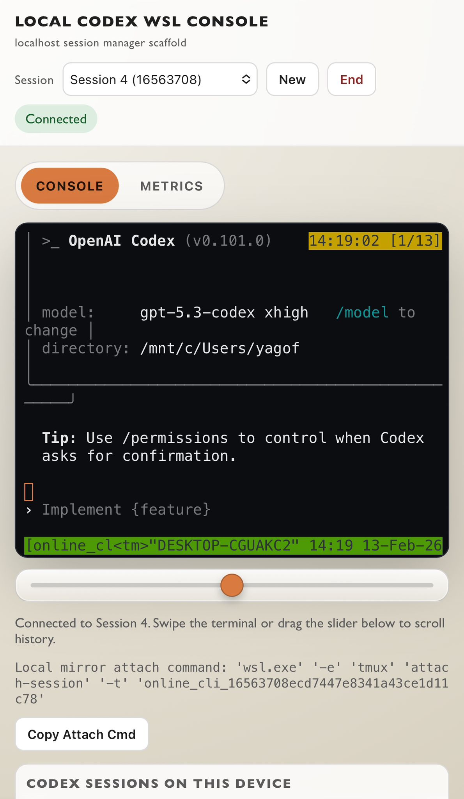
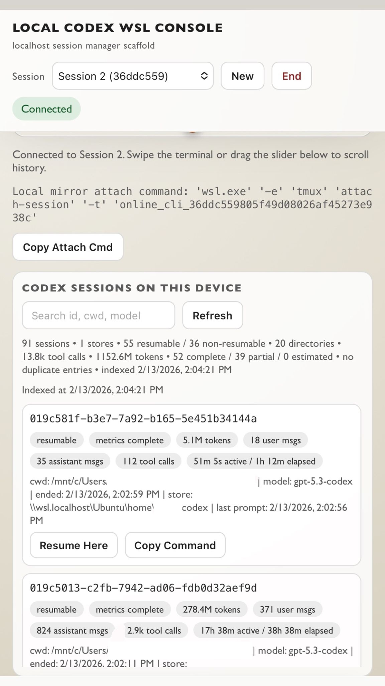
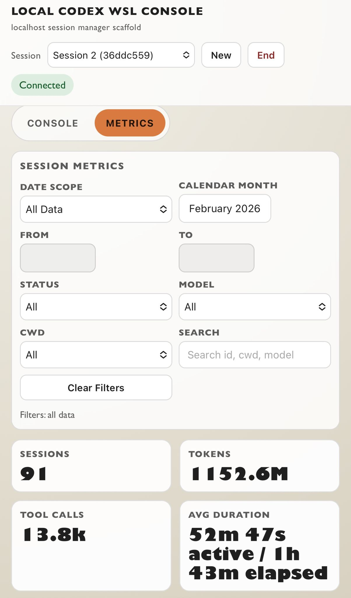
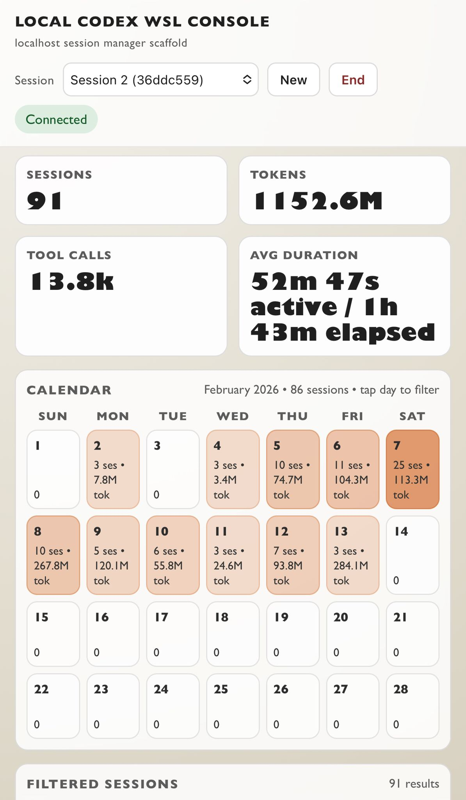
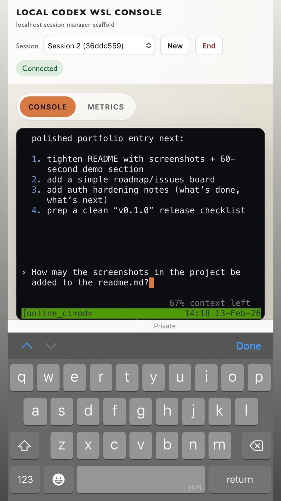
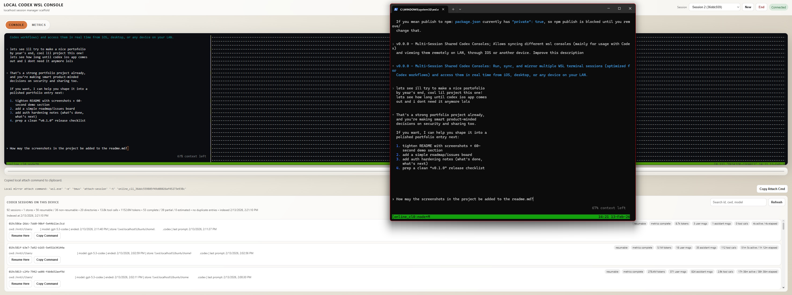
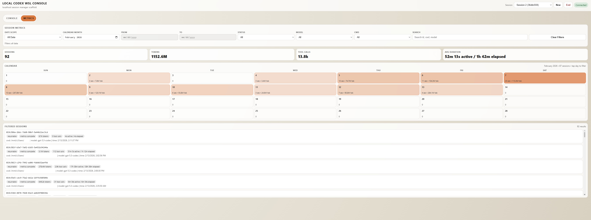

# Local Codex WSL Console

A localhost-first web console for WSL with a session-management scaffold suitable for evolving into a production architecture.

## What is included
- Per-session tmux-backed terminal state (refresh-safe attach/detach semantics)
- Direct tmux attach streaming per web client (desktop terminal + desktop web + iPhone web all read/write the same tmux session)
- Multi-session mode by default: each session is an independent tmux console with its own attach command
- REST API for session lifecycle (`/api/sessions`)
- Device-wide Codex session index + one-click resume into terminal sessions
  - Resume safety: sessions are marked resumable using local `~/.codex/history.jsonl`
  - WSL-only source selection to avoid Windows store resume mismatches
  - Duplicate session ids across stores are deduped before serving API results
  - Metrics now expose `metricsQuality` (`complete|partial|estimated`) and both `activeDurationMs` + `elapsedDurationMs`
- Session-scoped WebSocket streaming (`/ws?sessionId=...`)
- Optional remote desktop sidecar integration (`Remote` tab, decoupled from Console)
  - Browser stream via proxied WS (`/ws/remote`) and short-lived backend tokens
  - View-only by default, with explicit control enable toggle
  - Touch controls for iOS (tap/long-press/drag/two-finger wheel)
- Idle session cleanup + max session guardrails
- Graceful shutdown persistence:
  - Server shutdown detaches web clients but keeps tmux sessions alive
  - Active sessions are saved and restored on next server start
- Structured server modules (`src/config`, `src/http`, `src/sessions`, `src/ws`, `src/codex`)
- iOS touch scroll stability update in the frontend (no private xterm monkey-patching)
- Touch and wheel scrolling support for terminal history across desktop and iOS clients
- Top pill view switch with an in-depth metrics dashboard (calendar + filters + summary cards)

## Screenshots
### 1) Console view with Codex open


### 2) Codex session list


### 3) Metric filters


### 4) Calendar


### 5) iOS console synced with desktop (from screenshot 6)


### 6) Desktop console synced with iOS (from screenshot 5)


### 7) Calendar and metrics on desktop


## Requirements
- Windows with WSL installed and a default distro configured
- Node.js 18+
- `tmux` installed inside the runtime environment (usually your WSL distro)

## Run locally
From a shell where `tmux` is available (typically your WSL distro):
```bash
npm install
npm start
```

Open:
- `http://localhost:3000`

By default the server binds to `127.0.0.1` to stay localhost-only.
To access from another device on your LAN (for example iPhone), run with `HOST=0.0.0.0` and use your desktop IP in the browser.

### Optional `.env` setup
The server auto-loads `.env` from the project root.

```bash
cp .env.example .env
```

Then edit `.env` with your local settings (especially `AUTH_PASSWORD` if auth is enabled).

### Password lock (recommended for LAN sharing)
Set in `.env`:
```bash
HOST=0.0.0.0
AUTH_ENABLED=true
AUTH_PASSWORD=your-strong-password
```

After restart, unauthenticated users are redirected to `/login`, and both REST + WebSocket traffic require auth.

## Remote Desktop MVP (Windows sidecar)
Remote desktop is disabled by default and does not affect terminal behavior until enabled.

### 1) Enable backend proxy support
Set in `.env`:
```bash
REMOTE_ENABLED=true
REMOTE_AGENT_URL=http://127.0.0.1:3390
REMOTE_DEFAULT_MODE=view
```

### 2) Run the Windows sidecar
From Windows PowerShell:
```powershell
cd remote-agent
npm install
npm start
```

### 3) Use the new `Remote` tab
- `View only`: stream only, no input execution
- `Control enabled`: mouse/touch/keyboard routed to desktop
- `Open Keyboard` button (mobile-friendly) explicitly summons software keyboard for remote typing
- `Fullscreen` + zoom/pan/minimap controls make widescreen desktops usable from phones
- Quick Controls overlay now includes:
  - collapsible/draggable launcher when hidden
  - one-tap shortcut buttons (mouse, arrows, common desktop chords)
  - `Touch Mouse On/Off` toggle for touch-to-mouse behavior
- iOS true fullscreen path:
  - If opened in Safari tab, the fullscreen button shows Home Screen install guidance
  - Use `Share -> Add to Home Screen`, then launch the app icon for stable standalone fullscreen with touch controls

If the sidecar is offline or input automation is unavailable, the UI degrades to view-only/offline states and the terminal remains fully usable.

## Minimal Shared Setup (Desktop + iPhone + Local Terminal)
1. Start server in WSL:
```bash
npm install
HOST=0.0.0.0 npm start
```
2. Open web console on desktop and iPhone using `http://<desktop-ip>:3000`.
3. Create/select a session in each web client using the session picker.
4. Click `Copy Attach Cmd` for the selected session and run it in a local terminal to attach to that exact session.

## Multi-Session Mirror Workflow (Web + Local)
- Keep `SINGLE_CONSOLE_MODE=false` (default).
- Use `New` to create separate sessions (for example Session A/B/C).
- In each desktop terminal, run the selected session's `Copy Attach Cmd`.
- On iPhone, choose the matching session in the picker to mirror that same console.

## Private Remote Access Over Tailscale
- Setup guide: `docs/tailscale-setup.md`
- Windows helper script: `scripts/tailscale-serve.ps1`

Quick command example:
```powershell
tailscale serve --bg 3000
```

## Troubleshooting
- If startup fails with `@lydell/node-pty ... could not find the binary package`, reinstall dependencies in the same environment where you run the server (for example inside WSL):
```bash
rm -rf node_modules package-lock.json
npm install
```

## API
- `GET /api/health`
- `GET /api/sessions`
  - Response includes `singleConsoleMode`; each session snapshot includes `localAttachCommand`
- `GET /api/sessions/:sessionId`
- `POST /api/sessions`
- `POST /api/sessions/:sessionId/restart`
- `DELETE /api/sessions/:sessionId`
- `POST /api/sessions/:sessionId/command`
- `GET /api/codex/sessions`
  - Query params: `limit` (number or `all`), `search`, `cwd`, `refresh=1`
  - Optional query param: `resumable=1|0`
- `GET /api/codex/sessions/:codexSessionId`
- `POST /api/codex/sessions/:codexSessionId/resume`
- `GET /api/remote/status`
- `GET /api/remote/capabilities`
- `POST /api/remote/token`
- `WS /ws/remote?token=...`

## Environment options
- `HOST` (default: `127.0.0.1`)
- `PORT` (default: `3000`)
- `AUTH_ENABLED` (default: `false`; when `true`, `/login` password gate protects the app)
- `AUTH_PASSWORD` (required when `AUTH_ENABLED=true`)
- `AUTH_COOKIE_NAME` (default: `online_cli_auth`)
- `AUTH_SESSION_TTL_MS` (default: `43200000` / 12 hours)
- `AUTH_COOKIE_SECURE` (default: `false`; set `true` when serving via HTTPS)
- `REMOTE_ENABLED` (default: `false`; enables backend remote proxy + UI tab)
- `REMOTE_AGENT_URL` (default: `http://127.0.0.1:3390`)
- `REMOTE_DEFAULT_MODE` (`view|control`, default: `view`)
- `REMOTE_STREAM_FPS` (default: `8`)
- `REMOTE_JPEG_QUALITY` (default: `55`)
- `REMOTE_INPUT_RATE_LIMIT_PER_SEC` (default: `120`)
- `REMOTE_INPUT_MAX_QUEUE` (default: `300`)
- `REMOTE_TOKEN_TTL_MS` (default: `60000`)
- `MAX_SESSIONS` (default: `24`)
- `SESSION_IDLE_TIMEOUT_MS` (default: `2700000`)
- `SESSION_SWEEP_INTERVAL_MS` (default: `60000`)
- `DEFAULT_COLS` (default: `120`)
- `DEFAULT_ROWS` (default: `30`)
- `PTY_COMMAND` (default on Windows: `wsl.exe`)
- `PTY_ARGS` (space-delimited args)
- `PTY_CWD` (working directory for new sessions)
- `TMUX_COMMAND` (default: `tmux`)
- `TMUX_ARGS` (optional args for `TMUX_COMMAND`; when running Node on Windows, default behavior is equivalent to `TMUX_COMMAND=wsl.exe` and `TMUX_ARGS="-e tmux"`)
- `TMUX_HISTORY_LIMIT` (default: `200000`)
- `TMUX_MOUSE_MODE` (default: `true`; enables tmux mouse wheel/copy-mode scrolling for local and web-attached clients)
- `SINGLE_CONSOLE_MODE` (default: `false`; when set to `true`, forces one shared terminal and disables create/delete)
- `SESSION_STATE_FILE` (default: `<project>/.online-cli/sessions-state.json`; persisted session metadata used to restore sessions after restart)
- `WS_HEARTBEAT_MS` (default: `30000`)
- `LOG_LEVEL` (`debug|info|warn|error`, default: `info`)
- `CODEX_HOME` (default: `~/.codex`)
- `CODEX_SESSIONS_DIR` (default: `$CODEX_HOME/sessions`)
- `CODEX_HISTORY_FILE` (default auto-detected, including `$CODEX_HOME/history.jsonl`)
- `CODEX_EXTRA_SESSIONS_DIRS` (optional `;`-delimited extra Codex session dirs)

## Code layout
- `server.js`: entry point
- `src/server.js`: app bootstrap + graceful shutdown
- `src/config.js`: runtime config parsing
- `src/auth/authManager.js`: password auth session manager (cookie-based)
- `src/http/authRoutes.js`: login/status/logout endpoints
- `src/http/remoteRoutes.js`: remote status/capability/token endpoints
- `src/sessions/`: tmux-backed session runtime and manager
- `src/codex/codexSessionIndex.js`: parses local Codex JSONL sessions and metrics
- `src/ws/sessionGateway.js`: WebSocket routing and heartbeats
- `src/ws/remoteGateway.js`: authenticated remote stream/control websocket proxy
- `src/remote/remoteClient.js`: sidecar health/token/connection helper
- `src/http/sessionRoutes.js`: session API
- `public/`: browser app and styles
- `remote-agent/`: Windows host sidecar service (desktop capture + input automation)
- `docs/tailscale-setup.md`: private tailnet access guide
- `scripts/tailscale-serve.ps1`: Windows helper to configure `tailscale serve`
