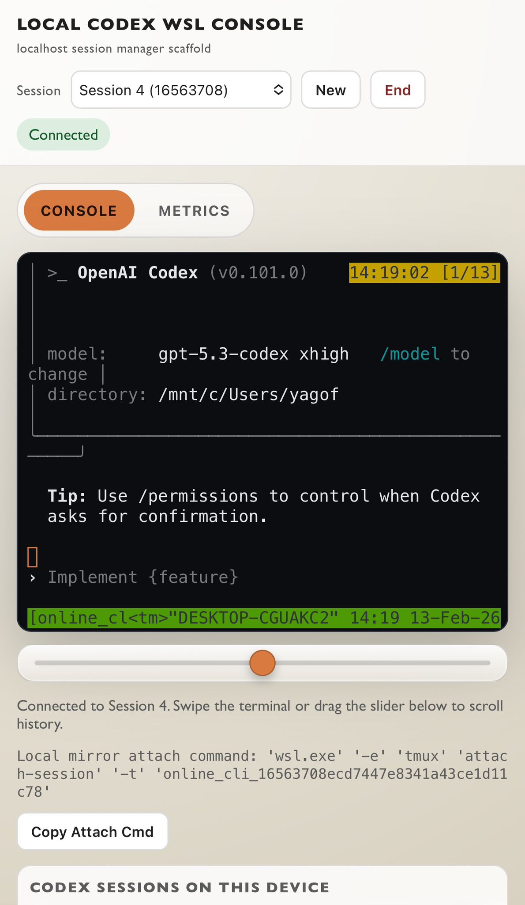
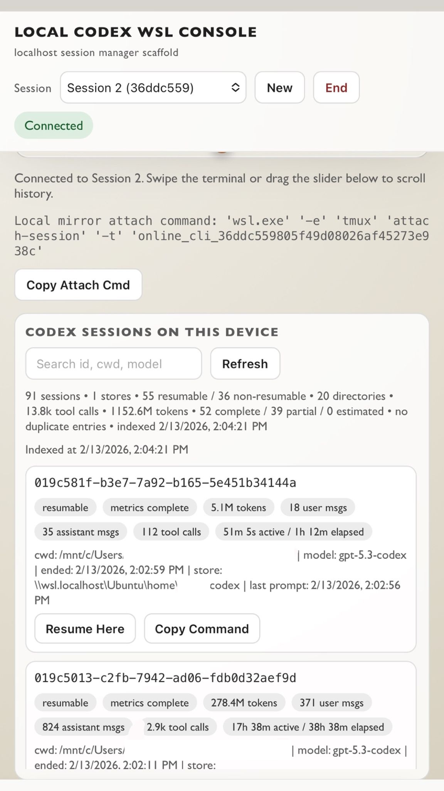
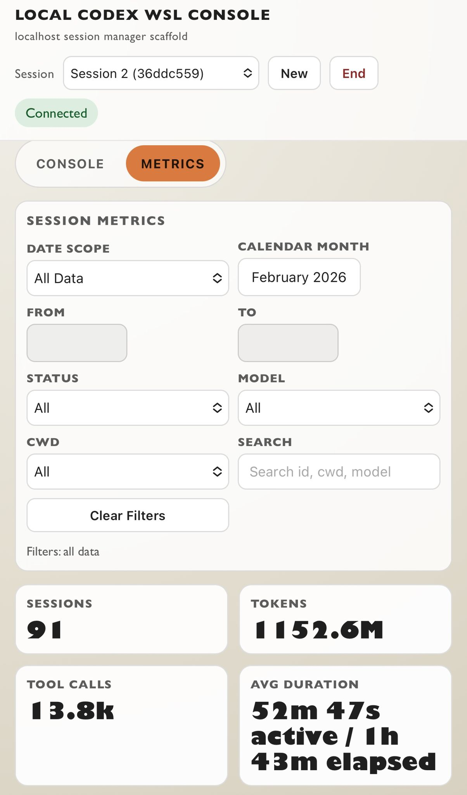
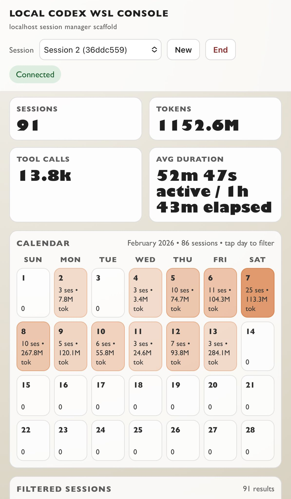
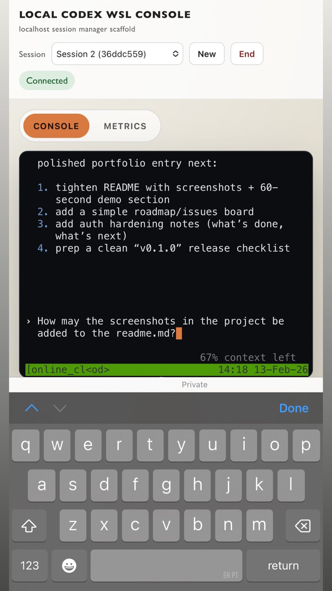
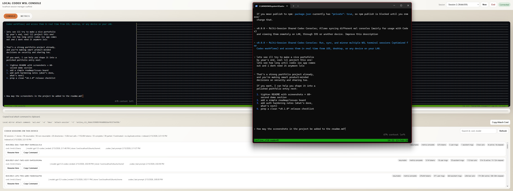
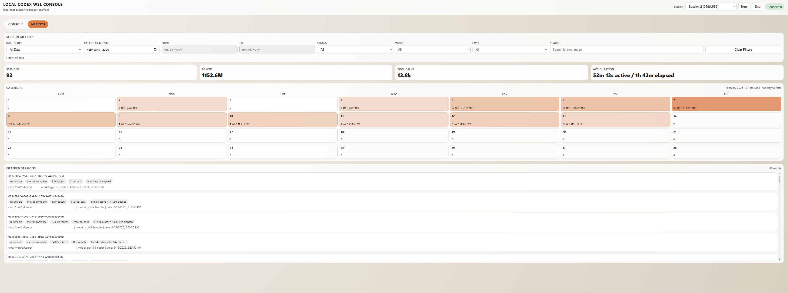

# Local Codex Native Console

A Tailscale-first console for native PowerShell terminals, Codex thread browsing, native iOS control surfaces, and optional remote desktop streaming.

## What is included
- Native PowerShell is the terminal runtime on Windows
- Direct persistent PTY sessions for PowerShell
- Multi-session mode by default: each terminal is an independent PowerShell console
- REST API for session lifecycle (`/api/sessions`)
- Device-wide Codex thread index + one-click resume into terminal sessions
  - Resume safety: sessions are marked resumable using local `~/.codex/history.jsonl`
  - Native PowerShell resume commands with Windows path normalization
  - Duplicate session ids across stores are deduped before serving API results
  - Metrics now expose `metricsQuality` (`complete|partial|estimated`) and both `activeDurationMs` + `elapsedDurationMs`
- Session-scoped WebSocket streaming (`/ws?sessionId=...`)
- Optional remote desktop sidecar integration (`Remote` tab, decoupled from Console)
  - Browser stream via proxied WS (`/ws/remote`) over the same tailnet access boundary
  - View-only by default, with explicit control enable toggle
  - Touch controls for iOS (tap/long-press/drag/two-finger wheel)
- Optional command sidecar for Windows host automation over Tailscale
  - Token-gated command runs, live output streaming, run history, stop support
  - Useful for fetching/pulling on Windows, restarting `npm start`, and closing the Mac/iOS/Windows loop
- Native iOS console, Codex Threads, metrics dashboard, stream presets, remote cursor relay, live gateway stats, and desktop shortcut actions
- Idle session cleanup + max session guardrails
- Graceful shutdown persistence:
  - Server shutdown detaches web clients; direct PTY sessions are recreated from saved metadata
  - Active sessions are saved and restored on next server start
- Structured server modules (`src/config`, `src/http`, `src/sessions`, `src/ws`, `src/codex`)
- iOS touch scroll stability update in the frontend (no private xterm monkey-patching)
- Touch and wheel scrolling support for terminal history across desktop and iOS clients
- Top pill view switch with an in-depth metrics dashboard (calendar + filters + summary cards)

## Screenshots
### 1) Console view with Codex open


### 2) Codex session list


### 3) Metric filters


### 4) Calendar


### 5) iOS console synced with desktop (from screenshot 6)


### 6) Desktop console synced with iOS (from screenshot 5)


### 7) Calendar and metrics on desktop


## Requirements
- Windows with PowerShell available
- Node.js 18+
- Tailscale installed, signed in, and running on the host

## Run
From the project root on the host where the `tailscale` CLI is available:
```bash
npm install
npm start
```

`npm start` verifies Tailscale is running, configures Tailscale Serve for `http://127.0.0.1:<PORT>`, starts the optional remote sidecar when `REMOTE_ENABLED=true`, and then starts the app.

Open the printed tailnet URL:
```text
https://<node>.<tailnet>.ts.net
```

The backend always binds to `127.0.0.1`. Plain `localhost` browser access is rejected; Tailscale Serve identity headers, Tailscale source addresses, and tailnet ACLs are the access layer.

### Optional `.env` setup
The server auto-loads `.env` from the project root.

```bash
cp .env.example .env
```

Then edit `.env` with your local settings.

### Tailscale access model
Tailscale is required. Startup fails if `tailscale status --json` cannot prove the node is connected, or if `tailscale serve --bg http://127.0.0.1:<PORT>` cannot be configured.

HTTP and WebSocket requests are accepted only when they arrive through Tailscale Serve identity headers or from Tailscale source ranges (`100.64.0.0/10`, `fd7a:115c:a1e0::/48`). Local browser requests to `localhost` are blocked.

## Native iOS App
The SwiftUI iPhone app lives in `ios/OnlineCLI.xcodeproj`. The Console tab is native SwiftUI/UIKit and talks directly to `/ws?sessionId=...`; it no longer embeds the browser console. It supports native PowerShell terminal creation, hardware/software keyboard input, resize messages, scrollback, paste/copy, and terminal control keys.

The old Sessions tab is now Threads. Terminal sessions are managed from Console; Codex threads are indexed and resumed from Threads or Metrics.

Run `npm start` first, keep Tailscale connected on the iPhone, then open the Xcode project and build the `OnlineCLI` scheme. The app defaults to the printed tailnet URL and can be changed in Settings.

The native remote tab uses the backend's capabilities contract instead of guessing: `/api/remote/capabilities` returns stream presets, supported shortcut actions, live gateway counts, input limits, and display metadata. The WebSocket also accepts `set-stream` messages, so the app can switch between Economy, Balanced, Fluid, and Sharp profiles while connected.

## Remote Desktop MVP (Windows sidecar)
Remote desktop is disabled by default and does not affect terminal behavior until enabled.

### 1) Enable backend proxy support
Set in `.env`:
```bash
REMOTE_ENABLED=true
REMOTE_AGENT_URL=http://127.0.0.1:3390
REMOTE_DEFAULT_MODE=view
```

### 2) Use the `Remote` tab
When `REMOTE_ENABLED=true`, the main `npm start` command installs missing sidecar dependencies and starts `remote-agent` automatically.

- `View only`: stream only, no input execution
- `Control enabled`: mouse/touch/keyboard routed to desktop
- `Open Keyboard` button (mobile-friendly) explicitly summons software keyboard for remote typing
- `Fullscreen` + zoom/pan/minimap controls make widescreen desktops usable from phones
- Quick Controls overlay now includes:
  - collapsible/draggable launcher when hidden
  - one-tap shortcut buttons (mouse, arrows, common desktop chords)
  - `Touch Mouse On/Off` toggle for touch-to-mouse behavior
- iOS true fullscreen path:
  - If opened in Safari tab, the fullscreen button shows Home Screen install guidance
  - Use `Share -> Add to Home Screen`, then launch the app icon for stable standalone fullscreen with touch controls

If the sidecar is offline or input automation is unavailable, the UI degrades to view-only/offline states and the terminal remains fully usable.

## Windows Command Sidecar
The command sidecar is separate from the main server so it can fetch, pull, and start the main server even when the main app is not already running. It binds to loopback, requires a bearer token, and is meant to be exposed privately with Tailscale Serve.

On Windows:
```powershell
cd command-sidecar
npm run token
$env:COMMAND_SIDECAR_TOKEN = "<generated-token>"
$env:COMMAND_SIDECAR_ROOTS = "C:\Users\yagof\Projects\codex-shared-online-cli"
$env:COMMAND_SIDECAR_BASE_PATH = "/cmd"
npm start
```

Expose it through Tailscale Serve:
```powershell
cd command-sidecar
.\tailscale-serve.ps1 -Path /cmd -Port 3777
```

From Mac/Codex:
```bash
export WINDOWS_COMMAND_URL="https://desktop-cguakc2.tailbca5e0.ts.net/cmd"
export WINDOWS_COMMAND_TOKEN="<generated-token>"

npm run windows:command -- --powershell --cwd 'C:\Users\yagof\Projects\codex-shared-online-cli' 'git fetch --all --prune; git pull --ff-only'
npm run windows:command -- --powershell --timeout-ms 0 --cwd 'C:\Users\yagof\Projects\codex-shared-online-cli' 'npm start'
```

See `command-sidecar/README.md` for the REST API and more examples. The Tailscale docs describe `tailscale serve --set-path` for path-based routing to loopback HTTP services: https://tailscale.com/kb/1242/tailscale-serve

## Minimal Shared Setup (Desktop + iPhone + Local Terminal)
1. Start everything:
```bash
npm install
npm start
```
2. Open the printed `https://<node>.<tailnet>.ts.net` URL on desktop or iPhone while Tailscale is connected.
3. Create/select a PowerShell session in each web client using the session picker.
4. Open the same session from another client to mirror the live console over WebSocket.

## Multi-Session Mirror Workflow (Web + Local)
- Keep `SINGLE_CONSOLE_MODE=false` (default).
- Use `New PowerShell` to create separate terminal sessions.
- PowerShell sessions are managed through the app/web socket and can be mirrored by selecting the same session from another client.
- On iPhone, choose the matching terminal in the Console controller to mirror that same console.

## Private Remote Access Over Tailscale
- Setup guide: `docs/tailscale-setup.md`
- Windows helper script: `scripts/tailscale-serve.ps1`

Quick command example:
```bash
npm start
```

## Troubleshooting
- If startup fails with `@lydell/node-pty ... could not find the binary package`, reinstall dependencies in the same environment where you run the server:
```bash
rm -rf node_modules package-lock.json
npm install
```

## API
- `GET /api/health`
- `GET /api/sessions`
  - Response includes `singleConsoleMode`, `defaultTerminalProfile`, and `terminalProfiles`; each terminal snapshot includes `terminalProfile` and `backend`
- `GET /api/sessions/:sessionId`
- `POST /api/sessions`
  - Optional body: `{ "terminalProfile": "powershell" }`
- `POST /api/sessions/:sessionId/restart`
- `DELETE /api/sessions/:sessionId`
- `POST /api/sessions/:sessionId/command`
- `GET /api/codex/sessions`
  - Query params: `limit` (number or `all`), `search`, `cwd`, `refresh=1`
  - Optional query param: `resumable=1|0`
- `GET /api/codex/sessions/:codexSessionId`
- `POST /api/codex/sessions/:codexSessionId/resume`
- `GET /api/remote/status`
- `GET /api/remote/capabilities`
  - Includes stream presets, supported desktop actions, display metadata, and live remote gateway stats
- `WS /ws/remote?mode=view|control`
  - Optional query params: `fps`, `quality`
  - Client control messages: `set-mode`, `set-stream`, `input`, `ping`

## Environment options
- `PORT` (default: `3000`)
- `REMOTE_ENABLED` (default: `false`; enables backend remote proxy + UI tab)
- `REMOTE_AGENT_URL` (default: `http://127.0.0.1:3390`)
- `REMOTE_DEFAULT_MODE` (`view|control`, default: `view`)
- `REMOTE_STREAM_FPS` (default: `10`)
- `REMOTE_JPEG_QUALITY` (default: `62`)
- `REMOTE_INPUT_RATE_LIMIT_PER_SEC` (default: `120`)
- `REMOTE_INPUT_MAX_QUEUE` (default: `300`)
- `MAX_SESSIONS` (default: `24`)
- `SESSION_IDLE_TIMEOUT_MS` (default: `2700000`)
- `SESSION_SWEEP_INTERVAL_MS` (default: `60000`)
- `DEFAULT_COLS` (default: `120`)
- `DEFAULT_ROWS` (default: `30`)
- `POWERSHELL_COMMAND` (default on Windows: `powershell.exe`, elsewhere: `pwsh`)
- `POWERSHELL_ARGS` (default: `-NoLogo`)
- `PTY_CWD` (working directory for new sessions)
- `SINGLE_CONSOLE_MODE` (default: `false`; when set to `true`, forces one shared terminal and disables create/delete)
- `SESSION_STATE_FILE` (default: `<project>/.online-cli/sessions-state.json`; persisted session metadata used to restore sessions after restart)
- `WS_HEARTBEAT_MS` (default: `30000`)
- `LOG_LEVEL` (`debug|info|warn|error`, default: `info`)
- `CODEX_HOME` (default: `~/.codex`)
- `CODEX_SESSIONS_DIR` (default: `$CODEX_HOME/sessions`)
- `CODEX_HISTORY_FILE` (default auto-detected, including `$CODEX_HOME/history.jsonl`)
- `CODEX_EXTRA_SESSIONS_DIRS` (optional `;`-delimited extra Codex session dirs)

## Code layout
- `server.js`: startup entry point
- `scripts/start.js`: Tailscale Serve + optional remote sidecar orchestrator
- `src/server.js`: app bootstrap + graceful shutdown
- `src/config.js`: runtime config parsing
- `src/network/tailscaleAccess.js`: loopback/Tailscale source and same-origin access checks
- `src/http/remoteRoutes.js`: remote status/capability endpoints
- `src/sessions/`: native PowerShell PTY runtime and manager
- `src/codex/codexSessionIndex.js`: parses local Codex JSONL sessions and metrics
- `src/ws/sessionGateway.js`: WebSocket routing and heartbeats
- `src/ws/remoteGateway.js`: tailnet-gated remote stream/control websocket proxy
- `src/remote/remoteClient.js`: sidecar health/connection helper
- `src/http/sessionRoutes.js`: session API
- `public/`: browser app and styles
- `remote-agent/`: Windows host sidecar service (desktop capture + input automation)
- `command-sidecar/`: token-gated Windows command runner for tailnet automation
- `scripts/windows-command.js`: local client for the command sidecar
- `docs/tailscale-setup.md`: private tailnet access guide
- `scripts/tailscale-serve.ps1`: Windows helper to configure `tailscale serve`
